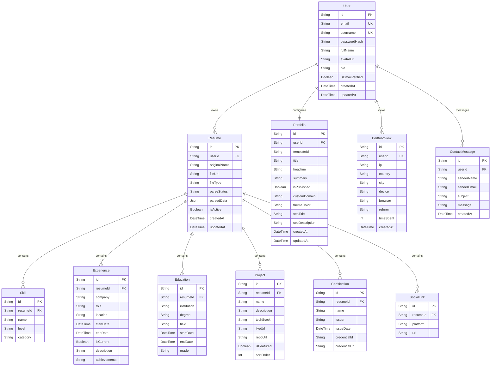

# Database Entity-Relationship Diagram (ERD)

This document contains a Mermaid JS visualization of the PostgreSQL database schema defined in `backend/prisma/schema.prisma`.

```mermaid
erDiagram
    User ||--o{ Resume : owns
    User ||--|| Portfolio : configures
    User ||--o{ PortfolioView : views
    User ||--o{ ContactMessage : messages

    Resume ||--o{ Skill : contains
    Resume ||--o{ Experience : contains
    Resume ||--o{ Education : contains
    Resume ||--o{ Project : contains
    Resume ||--o{ Certification : contains
    Resume ||--o{ SocialLink : contains

    User {
        String id PK
        String email UK
        String username UK
        String passwordHash
        String fullName
        String avatarUrl
        String bio
        Boolean isEmailVerified
        DateTime createdAt
        DateTime updatedAt
    }

    Resume {
        String id PK
        String userId FK
        String originalName
        String fileUrl
        String fileType
        String parseStatus
        Json parsedData
        Boolean isActive
        DateTime createdAt
        DateTime updatedAt
    }

    Portfolio {
        String id PK
        String userId FK
        String templateId
        String title
        String headline
        String summary
        Boolean isPublished
        String customDomain
        String themeColor
        String seoTitle
        String seoDescription
        DateTime createdAt
        DateTime updatedAt
    }

    Skill {
        String id PK
        String resumeId FK
        String name
        String level
        String category
    }

    Experience {
        String id PK
        String resumeId FK
        String company
        String role
        String location
        DateTime startDate
        DateTime endDate
        Boolean isCurrent
        String description
        String achievements
    }

    Education {
        String id PK
        String resumeId FK
        String institution
        String degree
        String field
        DateTime startDate
        DateTime endDate
        String grade
    }

    Project {
        String id PK
        String resumeId FK
        String name
        String description
        String techStack
        String liveUrl
        String repoUrl
        Boolean isFeatured
        Int sortOrder
    }

    Certification {
        String id PK
        String resumeId FK
        String name
        String issuer
        DateTime issueDate
        String credentialId
        String credentialUrl
    }

    SocialLink {
        String id PK
        String resumeId FK
        String platform
        String url
    }

    PortfolioView {
        String id PK
        String userId FK
        String ip
        String country
        String city
        String device
        String browser
        String referer
        Int timeSpent
        DateTime createdAt
    }

    ContactMessage {
        String id PK
        String userId FK
        String senderName
        String senderEmail
        String subject
        String message
        DateTime createdAt
    }
```
